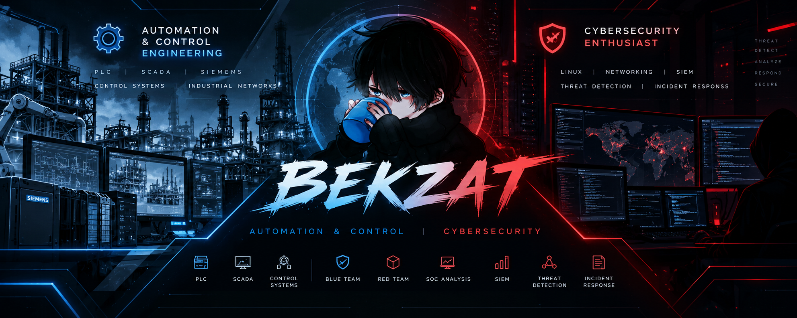

 

## ⚙️ Automation & Control Engineering and 🔐 Cybersecurity

# 👋 Hey, I'm Bekzat

### ⚙️ Automation & Control Engineering Student
### 🔐 Cybersecurity Enthusiast

# 👋 Hey, I'm Bekzat

### ⚙️ Automation & Control Engineering Student
### 🔐 Cybersecurity Enthusiast

  
  
  
  

---

## 👨‍💻 About Me

> I'm an **Automation & Control Engineering student** with an equal interest in  
> **industrial technologies and cybersecurity**.

I enjoy understanding how systems work — how they are **controlled, connected,
monitored, and secured**.

Currently, I'm building practical skills across both fields and exploring
different technologies through projects and hands-on labs.

---

<table>
<tr>

<td width="50%" valign="top">

## ⚙️ Automation & Control

🏭 Industrial Automation  
🎛️ Control Systems  
🔧 PLC  
🖥️ SCADA  
⚡ Industrial Technologies  
🌐 Industrial Networks  

</td>

<td width="50%" valign="top">

## 🔐 Cybersecurity

🔵 Blue Team  
🔴 Red Team  
🛡️ SOC Analysis  
📊 SIEM & Log Analysis  
🔎 Threat Detection  
🚨 Incident Response  

</td>

</tr>
</table>

---

## 🛠️ Technologies & Tools

### ⚙️ Automation & Control

### 🔐 Cybersecurity

### 💻 Programming & Tools

---
